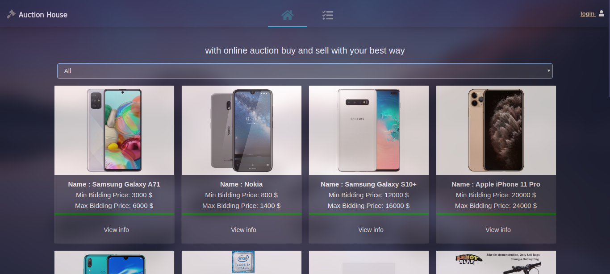
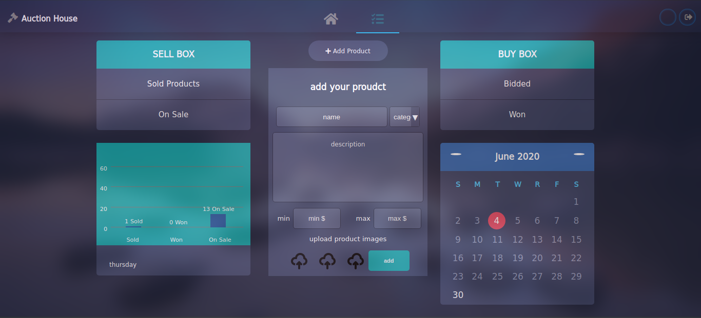
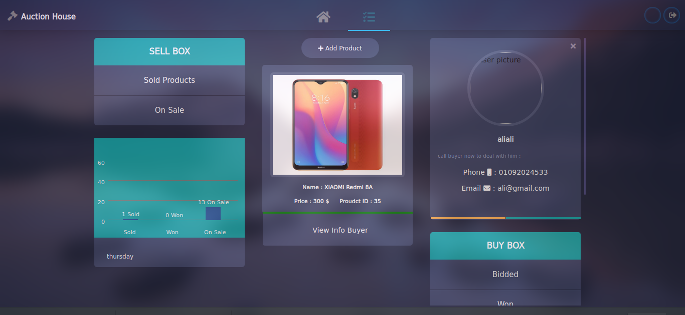
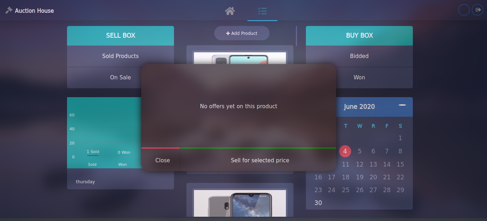
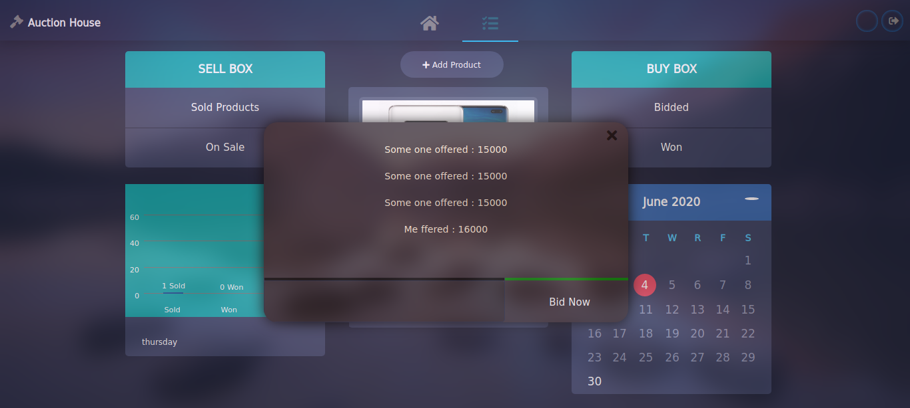

# Auction-House-nodejs

this first version 

1 - cheak database folder to make your database

2 - change info of your database by yours inside :
/bin/database/dbhome.js

3 - npm install 

4 - npm run 

live example : https://aucbidding.herokuapp.com/  
(if database account expired then u cant see live version  sorry hehehehe xd)

home : 

managment add proudct : 

etc : 

